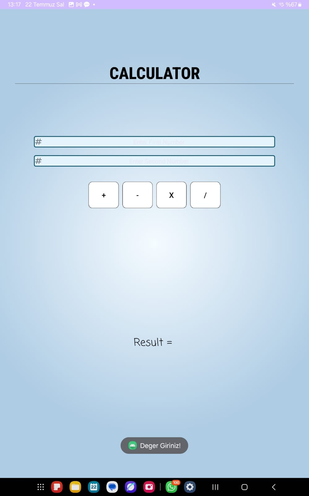
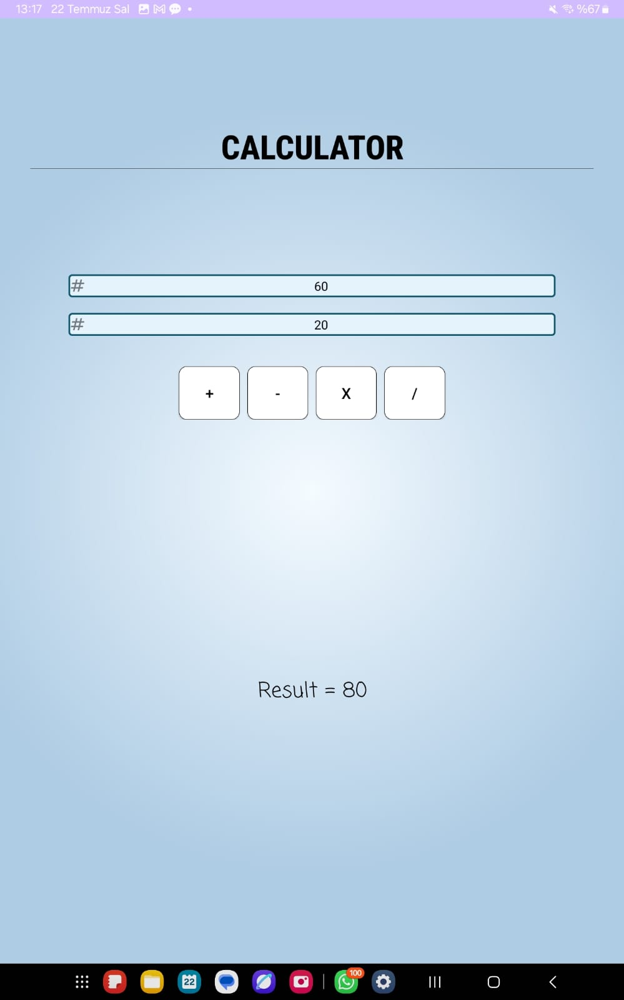

# 📱 Android Calculator App

A simple, clean, and modern-looking **calculator application** built for Android.  
This project was developed to practice and demonstrate core Android concepts and clean code principles.

---

## 🚀 Features

- ➕➖✖️➗ Basic arithmetic operations  
- 💾 Persistent data storage with `SharedPreferences`  
- 🔄 Automatically restores the last entered values on startup  
- ✅ Input validation to prevent empty values  
- 🧱 SOLID-compliant modular structure:
  - `CalculatorService` → Business logic
  - `InputHandler` → Input validation and parsing
  - `StorageManager` → Persistent key-value storage
  - `UIHelper` → Centralized Toast and Log management

---

## 🛠️ Technologies Used

- Java  
- Android SDK  
- XML (for UI layout)
- SharedPreferences  
- ConstraintLayout & LinearLayout

---

<table>
  <tr>
    <td></td>
    <td></td>
    <td></td>
    <td></td>
  </tr>
</table>

---
